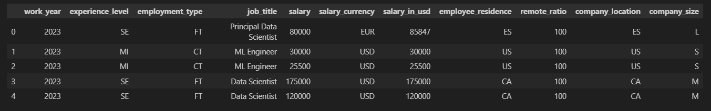
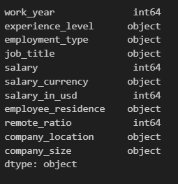
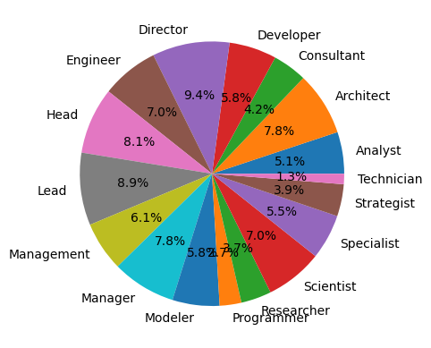
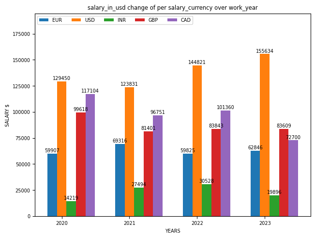
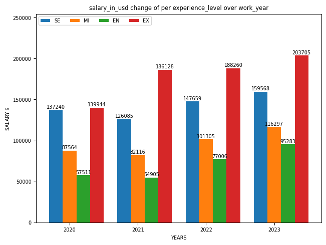
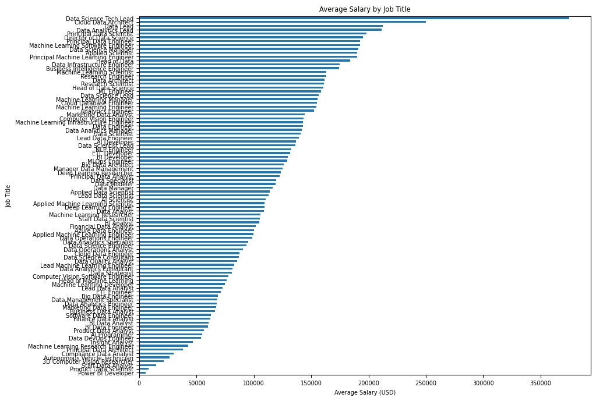
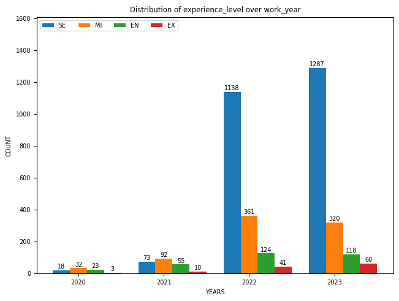
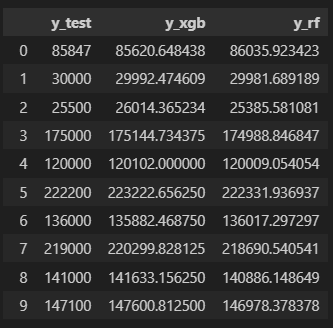
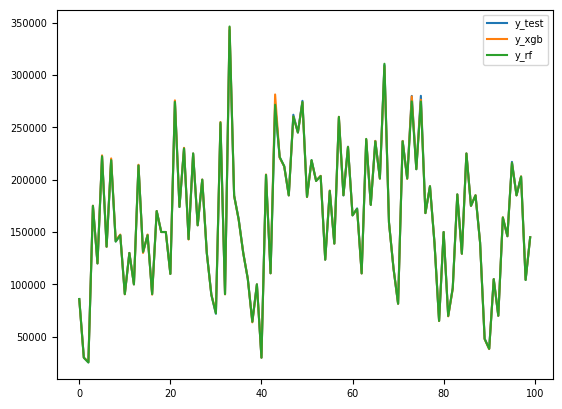

# Analysis and Prediction of Data Scientist Salary

In this project, I worked on Data Scientists' salary over years by their experience level, field, employment type, etc.

The environment can be installed with 

```

python3 -m venv venv/
source venv/bin/activate # for linux 
source venv/Scripts/activate # for windows
python3 -m pip install -U pip
python3 -m pip install -r requirements.txt

```

### Some acronyms
```
experience_level acronyms
SE : Senior.
EN : Entry level.
EX : Executive level.
MI : Mid/Intermediate level.

employment_type acronyms
FT: Full time.
PT: Part time.
CT: Contractor.
FL: Freelancer.
```

### Analysis

In this project, I decided to work on data scientist's salaries over the years. The reason is that the data science is becoming popular and for this purpose I decided to make some analysis and predict if it still will be a popular occupation in future.

In below, the data is visualized at a glance.



As a first step, the object types of each column is exported.



It shows us, the type "object" columns should be converted into ordinal or categorical values. Before going further with data processing, there are a couple of plots visualized for deeper understanding of data.


1. Salary over focus: The following pie chart illustrates the percentage breakdown of salary distribution across different job focuses such as engineer, lead, researcher, manager, etc.



2. Salary over currency: This multiple-bar plot visualizes the distribution of salary currencies (in USD). Please note that although there are typically more than five different currencies (EUR, USD, INR, GBP, CAD) in the dataset, we have excluded them as they do not have a consistent value for each year under consideration.





3. Salary over experience: This multiple-bar plot examines the impact of experience levels on salary.




4. Salary over job title: This horizontal bar plot illustrates the average salary for each unique job title.



5. Distribution of data scientist by their experience: : This multiple-bar plot visualizes the average salary at each experience level over the years.




### Preprocessing and Fitting

1. First of all, the data is check if there is any missing values appear in it. The data had already no missing values.
2. The data column types are converted into nominal or ordinal values. "job_title", "salary_currency", "employee_residence" are converted into categorical values. "experience_level", "employment_type", "company_size" columns are converted into nominal values.

    ```
    data['job_title_cat'] = data['job_title'].astype('category').cat.codes
    data['salary_currency_cat'] = data['salary_currency'].astype('category').cat.codes
    data['employee_residence_cat'] = data['employee_residence'].astype('category').cat.codes
    data['company_location_cat'] = data['company_location'].astype('category').cat.codes
    data['experience_level_cat'] = data['experience_level'].map(cfg.exp_lvl_map)
    data['employment_type_cat'] = data['employment_type'].map(cfg.emp_type_map)
    data['company_size_cat'] = data['company_size'].map(cfg.comp_size_map)
    ```

3. Data is splitted into train and test datasets by year (and also for the purpose of the course, kfold)

4. Note that, there is no normalization applied. I decided to work on XGBoost and RandomForest regressors which do not require a normalization.

5. Models are defined and the models are firstly fitted by data which splitted by year. Latter, the models are fit by k (=5) fold cross validation.

```
Model trained by timeseries data:
RMSE Error: 1005.7140360065457 for Random Forest Model
RMSE Error: 1022.025059969948 for XGBoost Model

Model trained by kfold cross validation:
K=5 Fold Cross Validation Score of RF: 0.9996741591907347 --> [0.99917798 0.99935141 0.99995338 0.99993784 0.99995019]
K=5 Fold Cross Validation Score of XGB: 0.9992367195817348 --> [0.99864769 0.99789353 0.99990138 0.99994215 0.99979885]

```

6. The scores for model trained by time series data looks like in below:



7. The predictions and groundtruth values are also plotted for a small portion of the dataset (for better visualization)

